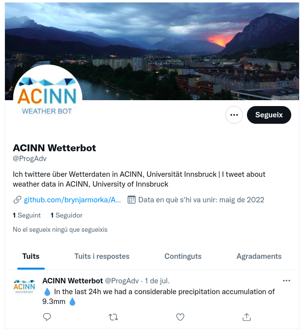

This is a twitter bot for interesting weather events from ACINN. Forked from 
https://github.com/stefanstoeckl/ACINN_twitter_bot.

# The account looks like that:

# And it can be embeded like this:

<html>
	<iframe id="twitter-widget-0" scrolling="no" frameborder="0" allowtransparency="true" allowfullscreen="true" class="twitter-timeline twitter-timeline-rendered" 		style="position: static; visibility: visible; display: inline-block; width: 100%; padding: 0px; border: none; max-width: 100%; min-width: 180px; margin-top: 0px; 	margin-bottom: 0px; min-height: 200px; height: 3485.89px;" data-widget-id="profile:ProgAdv" title="Twitter Timeline">	
	</iframe>
</html>

# Usage:
- add twitter credentials (requires developer account and a created twitter app) to a file called "config.ini" 
- run "twitter_bot.py".

# Requirements:
- Python
- numpy
- pandas
- tweepy 
- configparser
- pyarrow

Please use black to follow to PEP8

# The bot
- Loads the past 24h data from https://acinn-data.uibk.ac.at/innsbruck/1
- If there is any interesting data to be reported, a tweet is issued:
    - Interesting data can be:
        - last 24h mean temperature above 95th percentile or below 5th percentile
        - Special cases for extremes out of climatology (24htemp>tmax or 24htemp<tmin)
        - Precipitation above some threshold (for now hardcoded to 5mm/24h)
- If noticeable temperature and precipitation occur both during the last 24h a single tweet containing both data is published
- Needs to be put in some scheduler. In our case we use crontab, from linux. It is meant to run once a day, preferebly in the evening. 

# Further possible improvements
- Update the climatology comparison file for Innsbruck

# Improvements form last version:
- Crontab scheduler avoids having always-runing python session in the background.
- Weather data is compared to climate in case of temperature.   

# Weaknesses:
- Climatology is not updated automatically. The temperature distribution is going to change in the folowing years.

# Data sources:
- 10-min data from ACINN weather station. see data_license.txt for weather data from ACINN
- Daily 2m temperature mean data from 01011990-01012020 https://dataset.api.hub.zamg.ac.at/app/station-new/historical/klima-v1-1d?anonymous=true
